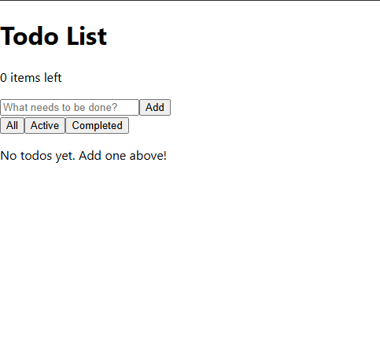

# ✅ React Todo List App

A modern, responsive todo list application built with React. Features a clean interface, local storage persistence, and full CRUD functionality.


## 📸 Screenshots




## ✨ Features

### Core Functionality
- ✅ **Add new todos** - Quick input with form validation
- ✅ **Mark complete/incomplete** - Toggle todo status with checkboxes
- ✅ **Edit todos** - Double-click or use edit button for inline editing
- ✅ **Delete todos** - Remove individual todos
- ✅ **Persistent storage** - Automatically saves to browser's localStorage

### Filtering & Organization
- 🔍 **Filter views** - All, Active, and Completed todos
- 📊 **Todo counter** - Real-time count of remaining active items
- 🗑️ **Clear completed** - Bulk remove finished todos

### User Experience
- 📱 **Fully responsive** - Works on desktop, tablet, and mobile
- 🎨 **Modern UI** - Clean, intuitive design with smooth animations
- ⌨️ **Keyboard shortcuts** - Enter to save, Escape to cancel editing
- 💾 **Auto-save** - Changes persist automatically

## 🛠️ Technology Stack

- **Frontend Framework**: React 18.2.0
- **State Management**: React Hooks (useState, useEffect)
- **Storage**: Browser localStorage
- **Styling**: Pure CSS with Flexbox/Grid
- **Icons**: (Optional - add if you include icons)

## 📦 Installation

### Prerequisites
- Node.js (version 14 or higher)
- npm or yarn

### Setup Instructions

1. **Clone the repository**
   ```bash
   git clone https://github.com/your-username/react-todo-app.git
   cd react-todo-app
